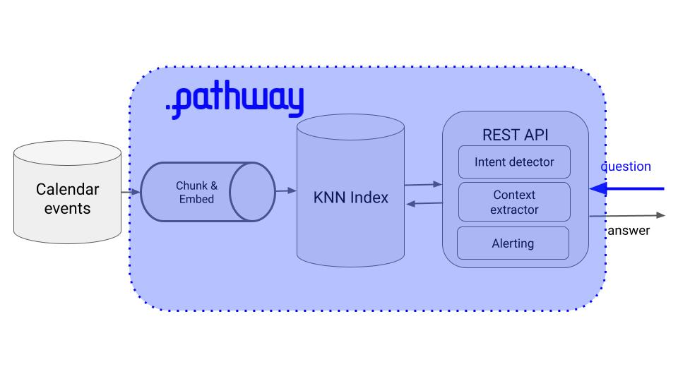

<div align="center">
    <a href='https://www.realworldml.xyz/'></a>    
</div>

<div align="center">
    <h1>Build a virtual assistant using real-time LLMs with Pathway</h1>
    
</div>

#### Table of contents
* [The problem](#the-problem)
* [Solution](#solution)
* [Run the whole thing in 5 minutes](#run-the-whole-thing-in-5-minutes)
* [Wanna learn more real-time ML?](#wanna-learn-more-real-time-ml)


## The problem

Building a Virtual Assistant using LLMs takes a bit more work than just sending API calls to OpenAI.


As soon as you start implementing such system, you quickly realize you need to spend a lot time building a backbone of infrastructure and data-engineering boilerplate, before you can even work on your business logic.

Which means, you spend too much time on the non-differentiating elements of your products, and not enough on the differentiating things.

So the question is:

Is there a faster way to build real-world apps using LLMs?

… and the answer is YES!

## Solution

Pathway is an open-source framework for high-throughput and low-latency real-time data processing.

Pathway provides the backbone of services and real-time data processing, on top of which you define your business logic in Python. So you focus on the business logic, and let Pathway handle the low-level details and data engineering boiler plate.

So you build real-world LLMOps app, faster.

Let’s see how to implement our virtual assistant using Pathway.


## Run the whole thing in 5 minutes

1. Install all project dependencies inside an isolated virtual env, using Python Poetry
    ```
    $ make init
    ```

2. Create an `.env` file and fill in the necessary credentials. You will need an OpenAI API Key, and a Discord Webhook to receive notifications.
    ```
    $ cp .env.example .env
    ```

3. Run the virtual assistant
    ```
    $ make run
    ```

4. Send the first request
    ```
    $ make request
    ```

5. Simulate push of first event to the data warehouse
    ```
    $ make push_first_event
    ```

6. Simualte push of the second event to the data warehouse
    ```
    $ make push_second_event
    ```

## Video lecture

🔜 Coming soon!

## Wanna learn more real-time LLMOps?

Join more than 10k subscribers to the Real-World ML Newsletter. Every Saturday morning.

[👉🏽 Click to subscribe](https://www.realworldml.xyz/subscribe)